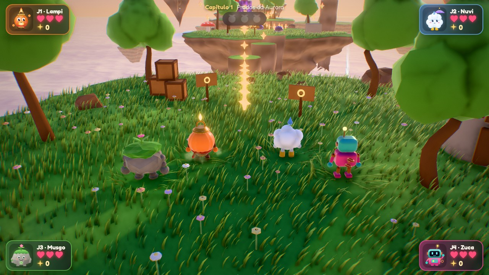
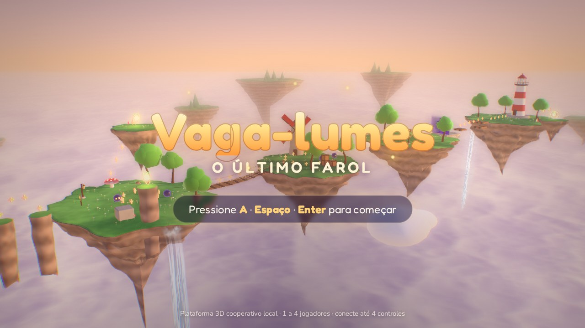
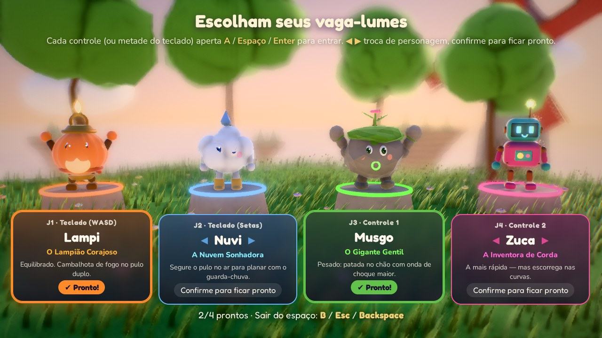
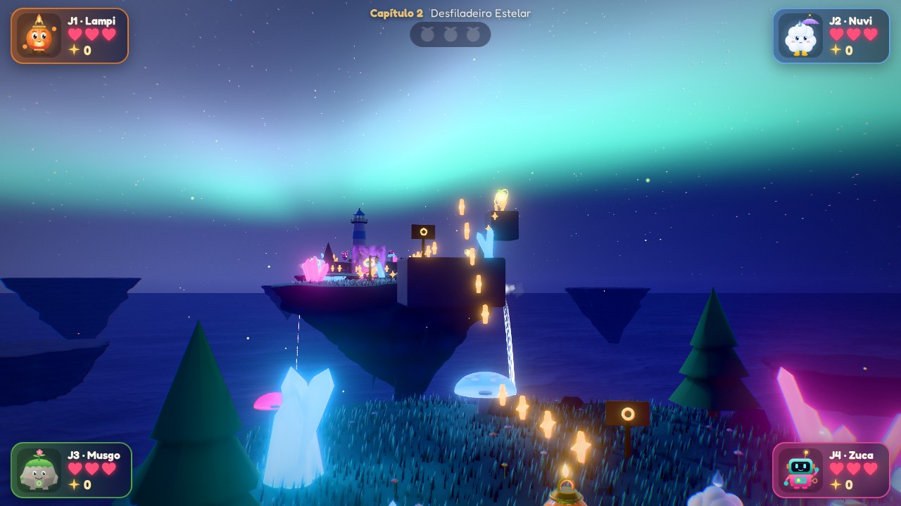
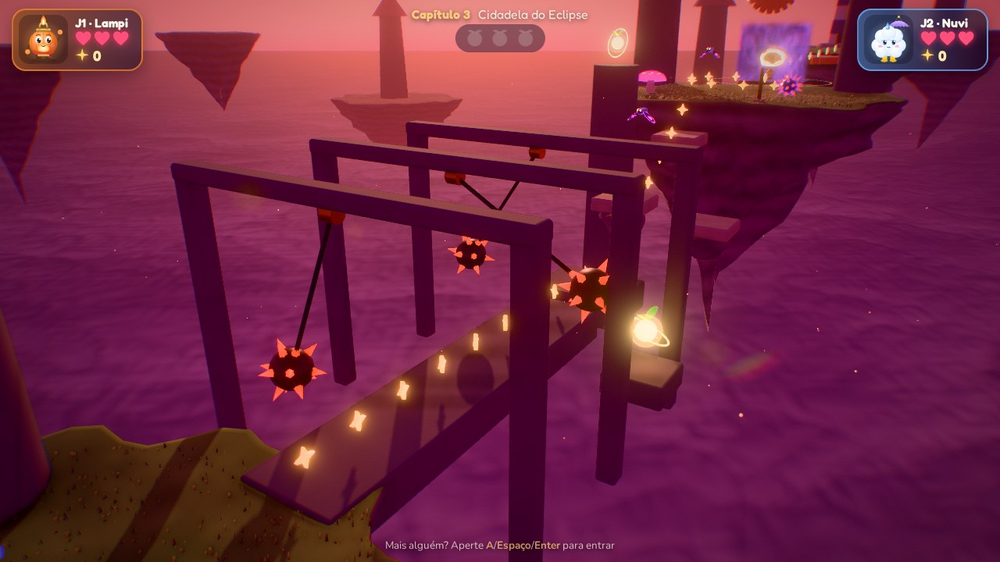
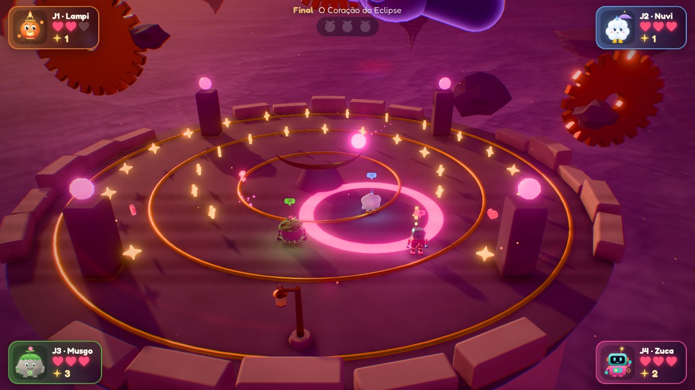
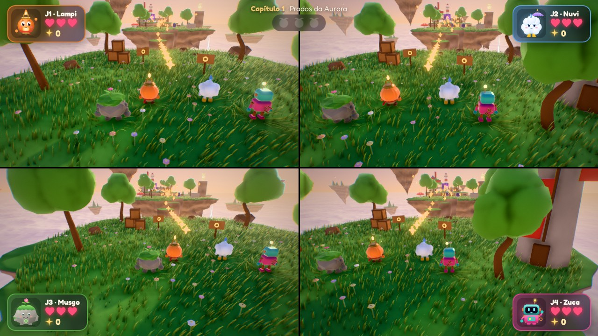
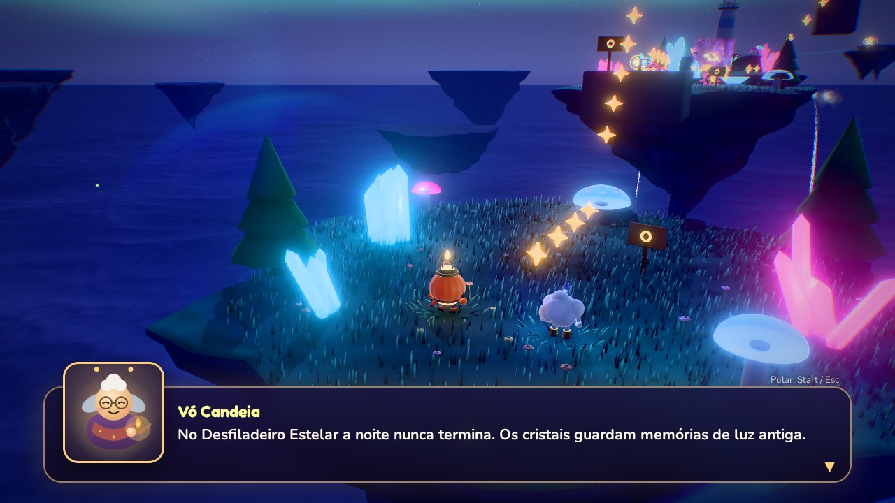
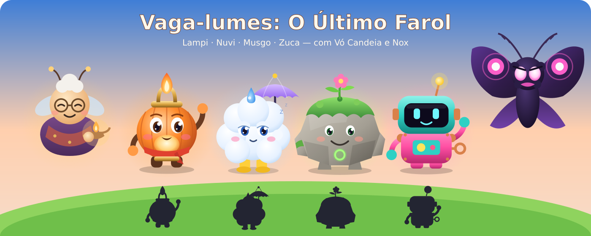

# Vaga-lumes: O Último Farol

**Plataforma 3D cooperativo local (couch co-op) para 1 a 4 jogadores**, feito com **three.js**, física **Rapier**, pipeline de pós-processamento e shaders próprios. Roda direto no navegador.



> Quando Nox, a Mariposa do Eclipse, engole a Chama Primordial, o sol não nasce e as ilhas do céu começam a afundar. Quatro pequenos vaga-lumes precisam reacender os faróis do Arquipélago de Aurora — porque *juntos, brilhamos mais*.

---

## Destaques

- **Co-op local de 1 a 4 jogadores:** dois no mesmo teclado + até quatro controles. **Entre e saia a qualquer momento** (drop-in/drop-out).
- **Câmera compartilhada** que enquadra todo mundo (estilo *Super Mario 3D World*) ou **tela dividida** para 2, 3 ou 4 (estilo *It Takes Two*), cada tela com pós-processamento completo.
- **Mecânicas cooperativas ligadas à história:** Véus de Sombra que somem mais rápido com mais vaga-lumes juntos, Pontes de Luz que só existem perto de alguém, pulo na cabeça do amigo, bolha para reviver e coroa para quem for melhor.
- **4 heróis** com silhuetas e estilos distintos — Lampi, Nuvi, Musgo e Zuca — **desenhados e modelados para este projeto**, com animação procedural (ciclo de corrida, squash & stretch, cambalhotas, piscadas, molas).
- **Campanha completa:** 3 capítulos + chefe final em 3 fases, história com diálogos e retratos, 12 Sementes de Luz escondidas.
- **Gráficos de inspiração AAA** em WebGL 2: HDR com MSAA, bloom físico (CoD: AW), SSAO, god rays, profundidade de campo, lens flare, tonemapping (Khronos Neutral / AgX / ACES), neblina de altura com dispersão do sol, céu procedural com nuvens, estrelas, aurora boreal e eclipse, grama instanciada interativa, IBL a partir do céu, sombras estáveis e resolução dinâmica.
- **Tudo procedural:** nenhum modelo, textura ou áudio externo. A música e os efeitos são sintetizados em tempo real.

## Como rodar

Requer **Node.js 20.19+** (ou 22.12+) e um navegador com **WebGL 2** (Chrome, Edge, Firefox ou Safari recentes).

```bash
npm install
npm run dev        # abre em http://localhost:5173
```

Para gerar a versão estática (pode ser hospedada em qualquer lugar, inclusive GitHub Pages):

```bash
npm run build      # gera dist/
npm run preview    # serve o build localmente
```

## Controles

| Ação | Controle | Teclado — Jogador 1 | Teclado — Jogador 2 |
|---|---|---|---|
| Entrar no jogo | A | Espaço | Enter |
| Andar | Analógico esquerdo / D-pad | W A S D | Setas |
| Pular (segure = mais alto) · pulo duplo | A | Espaço | Enter / Numpad 0 |
| Giro (ataque; no ar dá uma flutuadinha) | X / Y | F / E | Shift direito / Numpad 1 / . |
| Rolar no chão · Patada no ar | B / gatilhos | Shift esquerdo / C | Ctrl direito / Numpad 2 / / |
| Girar a câmera | Analógico direito / LB RB | Q / R | Delete / PageDown |
| Pausa | Start | Esc / Tab | P / Backspace |

**Dicas:** rolar + pular = **pulo longo**. A patada no chão quebra caixas e atordoa espinhelas. Nuvi plana segurando o pulo. Quem cai vira uma **bolha** — encoste nela para trazer o amigo de volta. A cada 50 centelhas você ganha um coração.

## Capturas

| | |
|---|---|
|  |  |
|  |  |
|  |  |



## Personagens



| Lampi | Nuvi | Musgo | Zuca |
|---|---|---|---|
| O Lampião Corajoso — equilibrado; pulo duplo com cambalhota de fogo. | A Nuvem Sonhadora — plana com o guarda-chuva. | O Gigante Gentil — patada com onda de choque maior. | A Inventora de Corda — a mais rápida, escorrega nas curvas. |

As fichas completas (personalidade, habilidade, notas de design, paleta e teste de silhueta) estão em [`docs/personagens/`](docs/personagens/). Elas são geradas a partir dos mesmos retratos vetoriais usados no jogo: `node scripts/build-art.mjs`.

## Documentação

- 📖 [**História**](docs/HISTORIA.md) — mundo, personagens, estrutura em capítulos, arco de Nox e diretrizes do roteiro.
- 🎮 [**Design**](docs/DESIGN.md) — pilares, números da movimentação, sistemas cooperativos, níveis, chefe, direção de arte, pipeline de renderização e arquitetura.
- 🔎 [**Referências**](docs/REFERENCIAS.md) — as referências de arte, design e tecnologia usadas, e onde cada uma aparece no código.

## Configurações gráficas

Em **Opções**: qualidade (Baixa, Média, Alta, Ultra), resolução dinâmica, câmera compartilhada ou tela dividida, volumes, tremor de tela, aberração cromática, granulado, vibração e contador de FPS. A resolução dinâmica ajusta a escala interna para manter ~60 FPS.

Parâmetros de URL úteis para testes: `?level=0..3&players=1..4&split=1&quality=ultra` (veja a lista completa em [DESIGN.md](docs/DESIGN.md#10-parâmetros-de-depuração-url)).

## Estrutura

```
src/
  core/      jogo e estados, entrada (teclado + controles), armazenamento, matemática
  render/    renderer, pós-processamento + shaders, céu, luz, grama, partículas, sombreamento do mundo
  world/     mundo e regras da co-op, construtor de níveis, física, câmeras, geometria procedural, níveis
  entities/  jogador, personagens, inimigos, chefe, plataformas, colecionáveis, objetos de cena
  ui/        interface (menus, HUD, diálogos), retratos SVG, estilos
  audio/     síntese de efeitos e sequenciador de música, trilhas
  story/     roteiro e fichas
docs/        história, design, referências, fichas de personagem e capturas
scripts/     gerador das fichas de personagem
```

## Tecnologias

[three.js](https://threejs.org) r186 · [Rapier](https://rapier.rs) (WASM) · [Vite](https://vite.dev) · WebAudio · Gamepad API · fontes Fredoka e Nunito (Fontsource).

Todo o conteúdo — código, shaders, modelos procedurais, arte dos personagens, música e roteiro — foi criado para este projeto.
