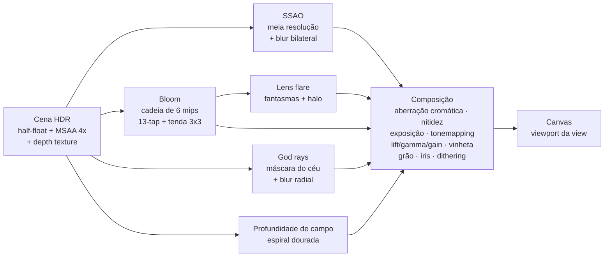

# Vaga-lumes: O Último Farol — Documento de Design

Plataforma 3D cooperativo **local** (couch co-op) para **1 a 4 jogadores**, no navegador, com **three.js** e física **Rapier**. Tudo é procedural: modelos, texturas, sons e música são gerados por código — não há arquivos de arte ou áudio externos.

## 1. Pilares

1. **Juntos, brilhamos mais.** Toda mecânica cooperativa reforça o tema: véus de sombra que somem mais rápido com mais gente, pontes de luz que só existem perto de um vaga-lume, pulo na cabeça do amigo, bolha para reviver.
2. **Sensação de controle impecável.** Pulo com altura variável, coyote time, buffer de pulo, aceleração responsiva e muita "juice" (squash & stretch, poeira, tremor, vibração).
3. **Brinquedo vivo.** Personagens com aparência de vinil/plástico (clearcoat), cenário de diorama e iluminação cinematográfica.
4. **Ninguém fica para trás.** Sem "game over": quem cai vira bolha e volta; entra e sai jogador a qualquer momento.

## 2. Controles

| Ação | Controle | Teclado J1 | Teclado J2 |
|---|---|---|---|
| Andar | Analógico esq. / D-pad | W A S D | Setas |
| Pular / pulo duplo | A | Espaço | Enter / Numpad 0 |
| Giro (ataque) | X / Y | F / E | Shift direito / Numpad 1 / . |
| Rolar (chão) · Patada (ar) | B / gatilhos | Shift esq. / C | Ctrl direito / Numpad 2 / / |
| Girar câmera | Analógico dir. / LB RB | Q / R | Delete / PageDown |
| Pausa | Start | Esc / Tab | P / Backspace |

Um teclado comporta dois jogadores (lado esquerdo e direito); até quatro controles pela Gamepad API.

## 3. Movimentação (números)

| Parâmetro | Valor | Observação |
|---|---|---|
| Altura do pulo | 2,55–2,75 m | por personagem |
| Tempo até o ápice | 0,37 s | gravidade = 2h/t² (Kyle Pittman) |
| Multiplicador de queda | 1,65× | queda mais "pesada" que a subida |
| Corte do pulo | 2,6× gravidade | soltar o botão encurta o pulo |
| Coyote time | 0,11 s | pular logo após sair da borda |
| Buffer de pulo | 0,14 s | apertar pouco antes de tocar o chão |
| Velocidade | 7,0–8,6 m/s | Zuca é a mais rápida |
| Giro | 0,42 s | no ar: pequeno impulso para cima, 1× por pulo |
| Patada | 0,2 s parado + queda a 32 m/s | onda de choque de 2,2–3,4 m |
| Rolamento | 13,5 m/s por 0,38 s | pular rolando = pulo longo |
| Nuvi planando | queda máx. 2,4 m/s por até 1,6 s | segurar pulo |

O movimento usa o **controlador cinemático de personagem do Rapier** (desliza em paredes, sobe degraus, gruda em rampas) e integração pelo ponto médio, para que a altura do pulo não dependa do FPS. Plataformas móveis informam uma matriz *delta* por quadro para carregar quem está em cima (inclusive em rotação, como nas engrenagens).

## 4. Sistemas cooperativos

- **Entrar e sair a qualquer momento (drop-in/drop-out):** qualquer controle ou metade do teclado aperta pular para entrar durante o jogo — o novo vaga-lume chega numa bolha. Pela pausa, um jogador pode sair.
- **Câmera compartilhada** (padrão, estilo *Super Mario 3D World*): enquadra todos os jogadores, segue uma rota de câmera autoral do nível, antecipa o movimento e não "pula" junto com cada salto (trava vertical suave).
- **Tela dividida** opcional (estilo *It Takes Two*): uma câmera de terceira pessoa por jogador, com colisão, em layouts de 2, 3 ou 4 telas.
- **Bolhas** (estilo *New Super Mario Bros. Wii*): quem cai ou perde os corações vira uma bolha iridescente que flutua até o amigo mais próximo; encostar nela revive. Se todos estiverem em bolhas, todos voltam ao último lampião.
- **Longe demais:** na câmera compartilhada, quem se afasta mais de 26 m do grupo por 1,6 s pega "carona" numa bolha.
- **Pulo na cabeça:** cair sobre um amigo dá um impulso — útil para alcançar lugares altos (e para brincar).
- **Véus de Sombra:** a velocidade de dissolução cresce de forma superlinear com o número de vaga-lumes no círculo de luz (sozinho ≈ 4,5 s; com quatro ≈ 0,8 s). Nunca bloqueiam quem joga sozinho.
- **Pontes de Luz:** painéis que só se solidificam perto de um vaga-lume.
- **Coroa:** na tela de resultados, quem fez mais pontos ganha a coroa (competição amigável).

## 5. Níveis

Cada capítulo tem 3 **Sementes de Luz** escondidas, dezenas de centelhas, lampiões (checkpoints) e termina num **farol** que acende com feixes de luz e confete.

| Capítulo | Ensina | Destaques |
|---|---|---|
| **1. Prados da Aurora** | pulo, pulo duplo, giro, patada, rolamento, primeiro véu | ilhas flutuantes, pedras-degrau, ponte de corda, moinhos, nuvens móveis, tábuas que desmoronam |
| **2. Desfiladeiro Estelar** | trampolins, pontes de luz, inimigos que não podem ser pisados | carrossel de plataformas de cristal, espinhelas, mariposombras, aurora boreal |
| **3. Cidadela do Eclipse** | ritmo e tempo | engrenagens giratórias, corredor de pêndulos, pistões, o maior véu |
| **Final. Coração do Eclipse** | tudo junto | chefe em 3 fases |

A "rota de câmera" de cada nível é uma polilinha que define a direção de avanço; pitch e distância podem ser ajustados por trecho.

## 6. Inimigos e chefe

- **Sombrinha:** patrulha → alerta ("!") → persegue saltitando → desiste e volta. Derrote pisando, girando, rolando ou com patada.
- **Espinhela:** rola num trilho; espinhos machucam quem pisa. Patada perto dela = atordoada por 3,5 s.
- **Mariposombra:** voa em círculo e dá rasantes quando alguém passa por baixo.

**Nox, a Mariposa do Eclipse** — máquina de estados com telegrafia clara:

```
intro → paira (orbes teleguiados) → [rajada de asas | invoca sombrinhas]* → marca o alvo no chão
      → mergulho → onda de choque (pule por cima!) → ATORDOADA (núcleo exposto)
      → acerto (pisão no núcleo ou patada) → fase seguinte (mais rápida) … → redenção
```

Cada acerto derruba um coração extra na arena. Os orbes podem ser destruídos com o giro.

## 7. Direção de arte

- **Formas:** personagens com silhuetas distintas (lanterna com chama, nuvem com guarda-chuva, pedra com flor, robô com antena) — validadas pelo teste de silhueta nas [fichas de personagem](personagens/).
- **Materiais:** vinil/plástico com clearcoat e rim light (personagens), pedra facetada com variação procedural, grama instanciada com translucidez contra o sol, cristais emissivos.
- **Color scripts por mundo** (inspirados nos color scripts da Pixar):
  - Prados: dourado + rosa pêssego, céu azul, sombras lavanda.
  - Desfiladeiro: azul-marinho, verde-água, ciano e magenta dos cristais, aurora verde→violeta.
  - Cidadela: magenta, vinho e dourado, contra a coroa laranja do eclipse.
  - Final: do eclipse ao nascer do sol (transição animada de toda a atmosfera).
- **Terreno procedural:** o shader decide grama/terra/rocha pela normal e por ruído em espaço de mundo, com estratos na rocha — as ilhas não usam texturas.

## 8. Tecnologia

### Pipeline de renderização (por view)



- **Uma pipeline por view**: a tela dividida roda o pós-processamento completo em cada metade/quadrante (tudo com render targets próprios e *scissor*).
- **Tonemapping:** Khronos PBR Neutral por padrão (preserva a saturação da arte estilizada); AgX e ACES disponíveis no shader.
- **Neblina:** exponencial de altura com integral analítica e dispersão na direção do sol (Inigo Quilez), injetada em todos os materiais PBR via `onBeforeCompile`.
- **Céu:** gradiente, sol/lua com halo, nuvens FBM com auto-sombreamento, estrelas cintilantes, aurora boreal em 16 camadas e eclipse com coroa. O mesmo céu gera o mapa de ambiente (IBL) com `PMREMGenerator`.
- **Mar de nuvens:** plano com ruído "billow" e normal derivada por diferenças finitas.
- **Sombras:** PCF (Vogel disk) com a câmera de sombra seguindo a ação e **texel snapping** (sem tremulação).
- **Grama:** `InstancedBufferGeometry` com LOD contínuo por distância, vento e interação com até 4 jogadores via uniforms.
- **Partículas:** sistema instanciado com formas geradas no shader (brilho, estrela, anel, fumaça, confete, coração, rastro), duas draw calls no total.
- **Resolução dinâmica:** mede o tempo de quadro e ajusta a escala interna (50–100%), com nitidez adaptativa na composição.
- **Presets:** Baixa / Média / Alta / Ultra (MSAA, tamanho da sombra, AO, god rays, DoF, flare, densidade de grama, partículas).

### Áudio
100% WebAudio: efeitos sintetizados (osciladores, ruído filtrado, sinos FM) com pan estéreo pela posição na tela, reverb por convolução com resposta ao impulso gerada, compressor no master e um **sequenciador de música** com agendamento *lookahead* tocando trilhas compostas como dados (pad, baixo, arpejo, melodia e bateria) — uma por mundo, mais tema, chefe e final.

### Arquitetura do código

```
src/
  core/      Game (estados e fluxo), Input (teclado + Gamepad API), Storage (opções e progresso), math
  render/    Renderer (views, resolução dinâmica), PostFX + shaders/, Sky, Lighting, WorldShading
             (neblina/rim/vento/terreno), Grass, Particles
  world/     World (regras da co-op), Level (DSL de construção), Physics (Rapier), CameraRig,
             geometry (geradores procedurais), environments, levels/
  entities/  Player, characters (modelos + animação procedural), Enemies, Boss, Platforms,
             Collectibles, Props (lampiões, farol, véus, caixas, pêndulos, pontes de luz)
  ui/        UI (menus, HUD, diálogos), portraits (SVG), styles.css
  audio/     Audio (síntese + sequenciador), tracks (trilha sonora)
  story/     script (roteiro), bios (fichas)
```

## 9. Acessibilidade e conforto

Tremor de tela, aberração cromática, granulado e vibração podem ser desligados. Há HUD por jogador com retratos coloridos, textos grandes para leitura no sofá, e nenhuma punição permanente por falhar.

## 10. Parâmetros de depuração (URL)

| Parâmetro | Efeito |
|---|---|
| `?level=0..3` | começa direto no capítulo |
| `&players=1..4` | número de jogadores (teclados + controles) |
| `&chars=lampi,nuvi,...` | personagens |
| `&split=1` | tela dividida |
| `&quality=baixa\|media\|alta\|ultra` | preset gráfico |
| `&intro=1` | mostra o diálogo de abertura |
| `&screen=lobby\|menu` | abre uma tela específica |
| `&grade=chave:valor,...` | ajusta o grading (ex.: `tonemap:0,exposure:1.2`) |
