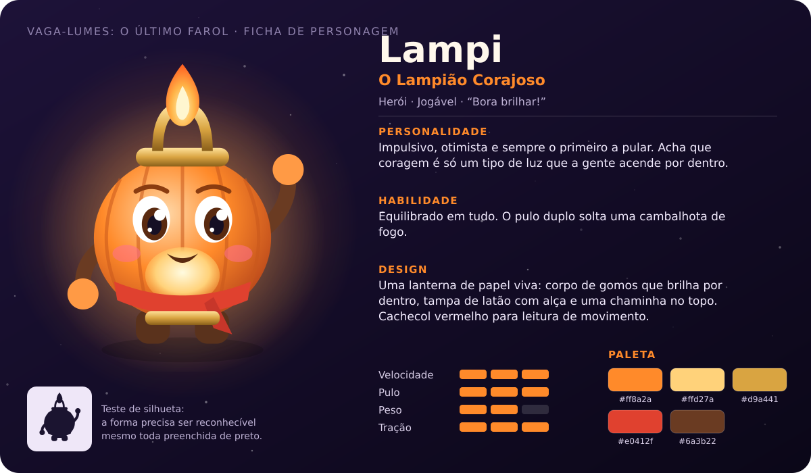
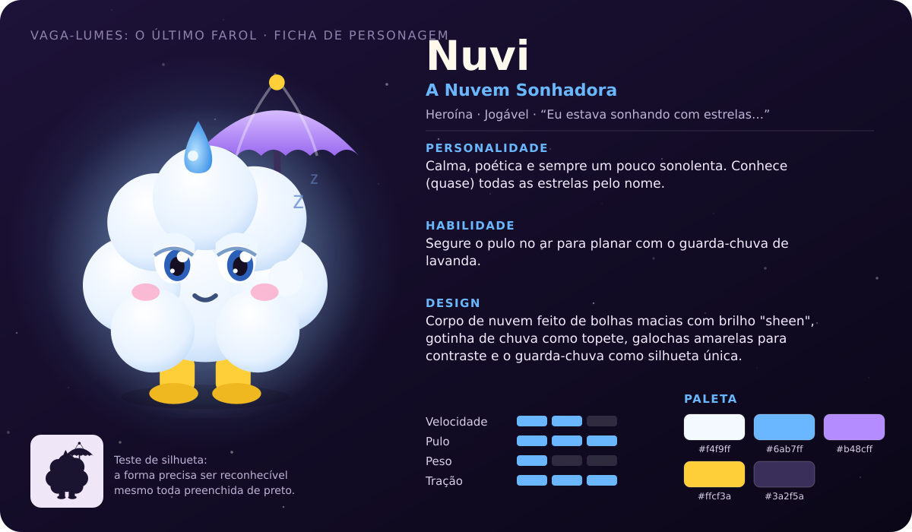
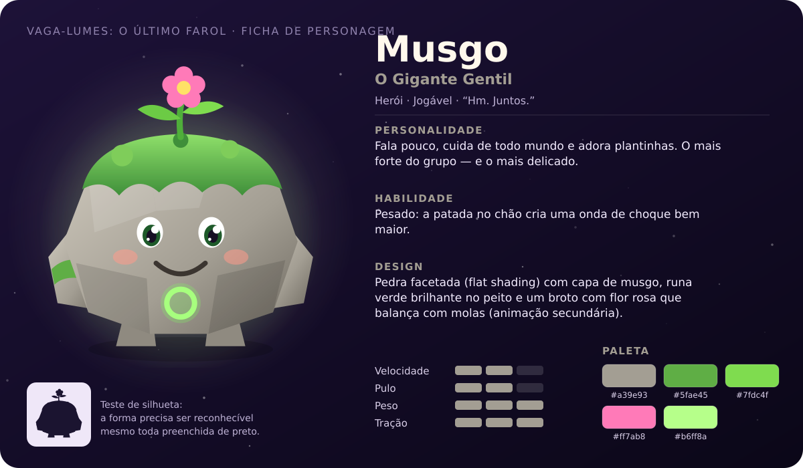
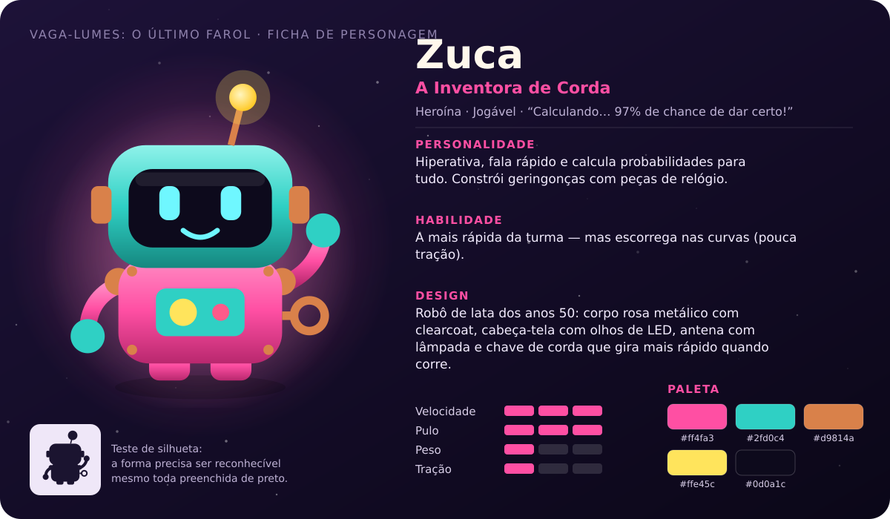
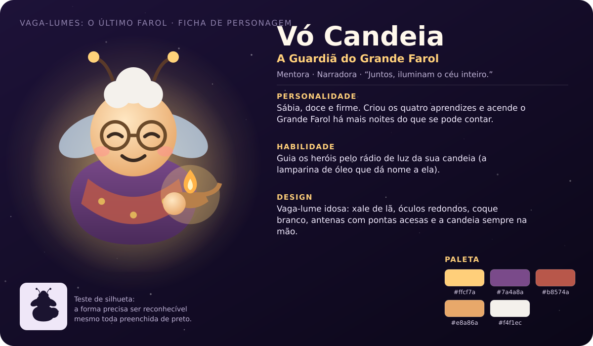
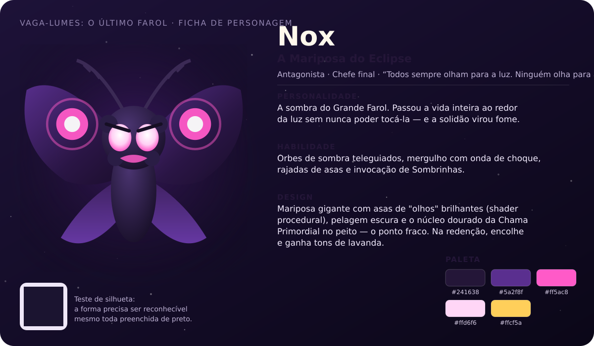

# Vaga-lumes: O Último Farol — Bíblia da História

> **Logline:** quando uma mariposa feita de sombra engole a luz que mantém o céu no lugar, quatro pequenos vaga-lumes precisam reacender os faróis do Arquipélago de Aurora — e descobrir que toda luz projeta uma sombra que também merece um lugar.

**Tema central:** *juntos, brilhamos mais.* A mensagem da história é a mesma da mecânica cooperativa: cada vaga-lume sozinho ilumina um caminho; juntos, iluminam o céu inteiro. O antagonista não é destruído — é **acolhido**.

**Tom:** aventura luminosa e acolhedora para todas as idades, com humor leve entre os heróis e um coração melancólico no vilão (referências de tom: *Kirby*, *Astro Bot*, *O Castelo no Céu* e *Ori*).

---

## 1. O mundo

### O Arquipélago de Aurora
Muito acima das nuvens, onde o céu vira oceano, flutua um arquipélago de ilhas verdes, cânions de cristal e cidadelas de engrenagens. Abaixo delas há apenas o **Mar de Nuvens**, infinito e macio.

As ilhas ficam no ar graças à luz. Cada uma tem um **farol**, e todos eles recebem a luz do **Grande Farol**, no centro do arquipélago.

### A Chama Primordial
No topo do Grande Farol arde a **Chama Primordial**: a luz que mantém as ilhas flutuando e que, a cada manhã, "acorda" o sol. Ela é cuidada pelos vaga-lumes guardiões há gerações.

### Centelhas e Sementes de Luz
- **Centelhas** são fragmentos pequenos da Chama, espalhados pelas ilhas depois do eclipse. Os heróis as recolhem pelo caminho (a cada 50, um vaga-lume recupera um coração).
- **Sementes de Luz** são fragmentos maiores, escondidos em lugares difíceis: três por capítulo.

### As regiões
| Região | Atmosfera | Ideia visual |
|---|---|---|
| **Prados da Aurora** | amanhecer eterno, dourado e rosado | moinhos, flores, pontes de corda, nuvens de algodão |
| **Desfiladeiro Estelar** | noite azul sob a aurora boreal | cristais que guardam memórias de luz, cogumelos brilhantes |
| **Cidadela do Eclipse** | crepúsculo magenta, sol eclipsado com coroa | engrenagens dos antigos relojoeiros do céu, pêndulos, pistões |
| **O Coração do Eclipse** | topo do Grande Farol, sem chama | arena circular sobre a torre listrada que desce até as nuvens |

---

## 2. Personagens

### Os heróis (jogáveis)
| | Personagem | Quem é | Na jogabilidade |
|---|---|---|---|
|  | **Lampi**, o Lampião Corajoso | Uma lanterna de papel viva. Impulsivo e otimista, o primeiro a pular. Bordão: *"Bora brilhar!"* | Equilibrado; pulo duplo com cambalhota de fogo. |
|  | **Nuvi**, a Nuvem Sonhadora | Uma nuvem sonolenta e poética que conhece (quase) todas as estrelas pelo nome. | Plana segurando o pulo, com o guarda-chuva. |
|  | **Musgo**, o Gigante Gentil | Uma pedra coberta de musgo, de poucas palavras e muito carinho. *"Hm. Juntos."* | Pesado: patada no chão com onda de choque maior. |
|  | **Zuca**, a Inventora de Corda | Uma robozinha de lata que calcula probabilidades para tudo. | A mais rápida; escorrega nas curvas. |

As diferenças são sutis de propósito (referência: *Super Mario 3D World*): **qualquer** combinação de 1 a 4 heróis consegue completar tudo.

### Vó Candeia — a mentora
A guardiã do Grande Farol, uma vaga-lume idosa de xale, óculos redondos e a candeia (lamparina de óleo) sempre acesa. Criou os quatro aprendizes e acompanha a jornada à distância, pelo brilho da candeia. É a voz da sabedoria da história e quem revela, no final, que Nox não é mau.

### Nox — a Mariposa do Eclipse
Nox é a **sombra do próprio Grande Farol**. Nasceu no único lugar em que a luz nunca chega: atrás dela. Passou a vida inteira voando ao redor do farol, atraída pela luz como toda mariposa, mas nunca podendo tocá-la sem se queimar. A solidão virou fome.

Na Noite do Longo Eclipse, Nox engole a Chama Primordial e se torna gigantesca, com asas cheias de "olhos" brilhantes — os olhos que ninguém nunca olhou de volta. Sua fala-chave: *"Todos sempre olham para a luz. Ninguém olha para a sombra!"*

**Arco:** vilã → compreendida → amiga. Ao devolver a Chama, Nox encolhe até virar uma mariposinha lavanda, que finalmente pode ficar perto da luz sem se queimar.

### Os capangas (poeira de sombra de Nox)
- **Sombrinhas:** bolinhas de sombra com olhos amarelos e chifrinhos. Patrulham e perseguem; odeiam luz, "adoram" um pisão na cabeça.
- **Espinhelas:** ouriços de sombra com espinhos magenta. Não podem ser pisadas; uma patada no chão as atordoa.
- **Mariposombras:** pequenas mariposas de sombra que voam em círculos e dão rasantes.

---

## 3. Estrutura da história

### Prólogo — A Noite do Longo Eclipse
O narrador apresenta o arquipélago e a Chama. Nox aparece, engole a luz e a parte em milhares de centelhas. O sol não nasce; as ilhas começam a afundar. Vó Candeia acorda os quatro aprendizes e dá a missão: reacender os faróis e seguir a trilha de luz até a Cidadela do Eclipse.

### Capítulo 1 — Prados da Aurora
*Batida emocional:* coragem e descoberta. Os heróis aprendem a pular, girar e dar patadas enquanto atravessam moinhos e pontes de corda. Encontram o primeiro **Véu de Sombra** e descobrem que, juntos, a luz deles o desfaz. Reacendem o **Farol dos Prados** — as ilhas param de afundar.

### Capítulo 2 — Desfiladeiro Estelar
*Batida emocional:* maravilhamento. A noite nunca termina; a aurora dança no céu. Pontes de Luz só existem perto dos vaga-lumes (o caminho literalmente depende deles). Nuvi brilha neste capítulo. Reacendem o **Farol de Cristal** e "as estrelas cantam".

### Capítulo 3 — Cidadela do Eclipse
*Batida emocional:* tensão e determinação. Nox travou as engrenagens do dia e da noite num crepúsculo eterno. Zuca se diverte com os mecanismos; Lampi sente o calor da Chama lá em cima. Chegam à **Torre do Relógio**.

### Final — O Coração do Eclipse
*Batida emocional:* confronto → compaixão. A luta contra Nox no topo do Grande Farol. Vó Candeia ensina o ponto fraco (o núcleo de luz exposto após o mergulho). Na terceira vez, a Chama salta do peito de Nox e volta ao farol, que acende "como um segundo sol".

### Epílogo — Há lugar para todos na luz
Nox, agora pequena, diz que "está quentinho aqui". Lampi a convida a ficar: *"Todo farol precisa de uma sombra para lembrar o quanto brilha."* O sol nasce. Dizem que, nas noites mais escuras, uma mariposinha dança ao redor do Grande Farol — não para apagá-lo, mas para fazer companhia a ele.

---

## 4. Roteiro

O roteiro completo (todas as falas do jogo, em português) está em [`src/story/script.js`](../src/story/script.js). Algumas falas:

> **Vó Candeia:** Lembrem-se: um vaga-lume sozinho ilumina um caminho. Juntos, iluminam o céu inteiro.
>
> **Zuca:** Calculando… 97% de chance de sucesso! Os outros 3% são pura aventura!
>
> **Nox:** Pequenas luzes… vieram me apagar?
>
> **Lampi:** Você pode ficar com a gente! Todo farol precisa de uma sombra para lembrar o quanto brilha.

### Diretrizes de escrita
- Falas curtas (1–2 linhas) para não travar o ritmo da co-op.
- Cada herói tem uma "voz" reconhecível: Lampi exclama, Nuvi divaga, Musgo resume, Zuca calcula.
- O humor nasce do contraste entre eles; a emoção nasce de Nox.
